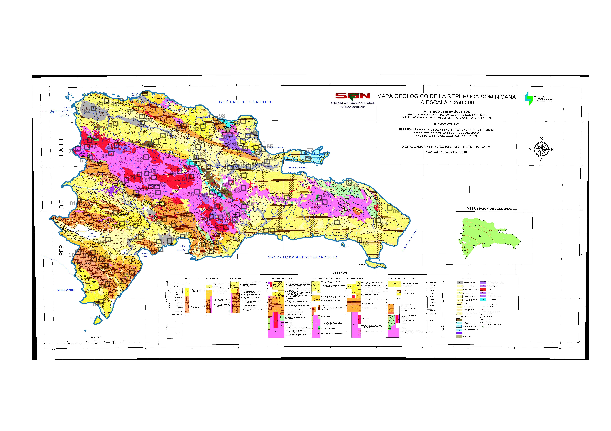
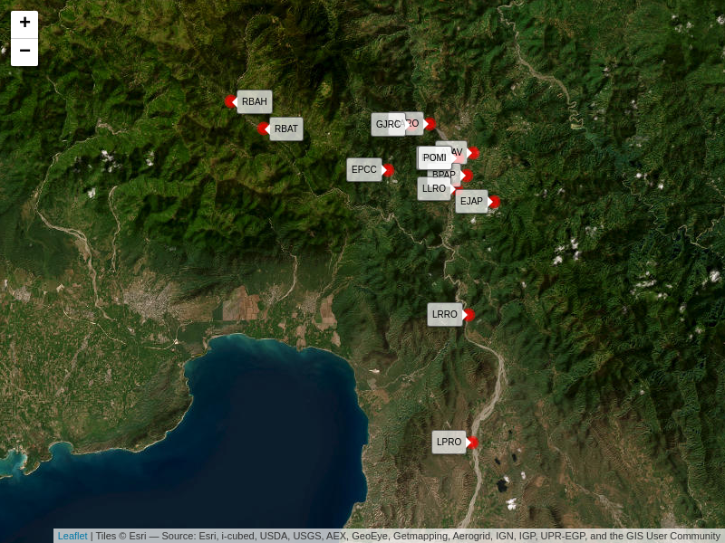

Prácticas de aula 5 (PA05). Tiempo en
geomorfología<small><br>Geomorfología (GEO-114)<br>Universidad Autónoma
de Santo Domingo (UASD)<br>Semestre 2024-02</small>
================
El Tali
2024-09-16

Versión HTML (quizá más legible),
[aquí](https://geofis.github.io/tiempo-en-geomorfologia/README.html)

# Fecha/hora de entrega

**16 de septiembre de 2024, 7:59 pm.**

# Objetivos

- Aplicar técnicas de datación relativa utilizando la elevación
  topográfica y la cronología de las rocas.

- Realizar cálculos de datación absoluta a partir de porcentajes
  isotópicos remanentes, empleando fórmulas matemáticas.

- Calcular la tasa de denudación anual y proyectarla a largo plazo para
  diferentes cuencas hidrográficas.

- Analizar y comparar los tamaños de clastos de diferentes tipos de
  rocas en tramos altos y bajos de un río, aplicando métodos
  estadísticos.

- Desarrollar habilidades en la interpretación de datos geológicos y
  geomorfológicos para comprender los procesos de evolución del relieve.

# Ejercicio 1. Datación relativa usando la elevación topográfica y la edad de las rocas

Usa [este mapa geológico con recuadros
rotulados](data/mapa-geo250k-recuadros.jpg), incrustado también a
continuación.

<figure>

<figcaption aria-hidden="true"><a
href="data/mapa-geo250k-recuadros.jpg">Mapa de recuadros rotulados.
Localiza el tuyo de la siguiente manera. Identifica los dos últimos
números de tu matrícula; 2) Localiza el recuadro rotulado con dicho
número</a></figcaption>
</figure>

Una vez hayas Localizado tu recuadro de 5x5 km, identifica las rocas que
hay dentro del cuadro, tanto su tipología, como su edad (si no logras
ver las rocas o el mapa es difuso, puedes confirmar con
[este](https://drive.google.com/file/d/1NKyZjxzIedFq6Lq0bx-2YrGq5PtMh_r7/view),
o con [este](data/geo250k.jpg) o con [este otro](data/geo250k.tif)).
Refresca la cronología siguiendo la tabla cronoestratigráfica
internacional, usando [este
enlace](data/tabla-cronoestratigrafica-2021.pdf) o [este
otro](https://stratigraphy.org/ICSchart/ChronostratChart2021-05Spanish.pdf).

Redacta un párrafo que sintetice la evolución del relieve, con sus
dataciones relativas debidamente identificadas.

# Ejercicio 2. Datación absoluta a partir del porcentaje isotópico remanente

Enviaste una muestra para datación por radioisótopo <sup>14</sup>C al
laboratorio, y te reportaron que el porcentaje remanente es el asignado
abajo (usa los dos dígitos terminales de tu matrícula para encontrar el
porcentaje asignado a ti). Usa la fórmula N<sub>0</sub>=Ne<sup>-λt</sup>
y la tabla 6.1 de Anderson and Anderson (2010) para calcular la edad
aproximada de la muestra. Interpreta el resultado.

| Dos dígitos terminales de matrícula | Porcentaje remanente |
|:------------------------------------|---------------------:|
| 00                                  |                   47 |
| 01                                  |                   32 |
| 02                                  |                   43 |
| 03                                  |                   21 |
| 04                                  |                   61 |
| 05                                  |                   31 |
| 06                                  |                   12 |
| 07                                  |                   19 |
| 08                                  |                   30 |
| 09                                  |                   67 |
| 10                                  |                    8 |
| 11                                  |                   81 |
| 12                                  |                   87 |
| 13                                  |                   29 |
| 14                                  |                   85 |
| 15                                  |                   83 |
| 16                                  |                   94 |
| 17                                  |                   13 |
| 18                                  |                    3 |
| 19                                  |                   77 |
| 20                                  |                    6 |
| 21                                  |                   70 |
| 22                                  |                   37 |
| 23                                  |                   84 |
| 24                                  |                   57 |
| 25                                  |                   53 |
| 26                                  |                   45 |
| 27                                  |                   97 |
| 28                                  |                   75 |
| 29                                  |                   64 |
| 30                                  |                   82 |
| 31                                  |                   59 |
| 32                                  |                   91 |
| 33                                  |                   74 |
| 34                                  |                   62 |
| 35                                  |                   80 |
| 36                                  |                   38 |
| 37                                  |                   14 |
| 38                                  |                   51 |
| 39                                  |                   76 |
| 40                                  |                   20 |
| 41                                  |                   46 |
| 42                                  |                   79 |
| 43                                  |                   16 |
| 44                                  |                   66 |
| 45                                  |                   28 |
| 46                                  |                   44 |
| 47                                  |                   11 |
| 48                                  |                   89 |
| 49                                  |                   34 |
| 50                                  |                   39 |
| 51                                  |                   78 |
| 52                                  |                   49 |
| 53                                  |                   63 |
| 54                                  |                   50 |
| 55                                  |                   10 |
| 56                                  |                   48 |
| 57                                  |                   42 |
| 58                                  |                   88 |
| 59                                  |                   65 |
| 60                                  |                   54 |
| 61                                  |                   90 |
| 62                                  |                   55 |
| 63                                  |                    2 |
| 64                                  |                   26 |
| 65                                  |                   68 |
| 66                                  |                   27 |
| 67                                  |                   60 |
| 68                                  |                   40 |
| 69                                  |                   41 |
| 70                                  |                   56 |
| 71                                  |                    7 |
| 72                                  |                   36 |
| 73                                  |                   71 |
| 74                                  |                   24 |
| 75                                  |                   18 |
| 76                                  |                   25 |
| 77                                  |                    4 |
| 78                                  |                   22 |
| 79                                  |                   58 |
| 80                                  |                   33 |
| 81                                  |                   15 |
| 82                                  |                   72 |
| 83                                  |                   23 |
| 84                                  |                    5 |
| 85                                  |                   17 |
| 86                                  |                    9 |
| 87                                  |                   98 |
| 88                                  |                   35 |
| 89                                  |                   99 |
| 90                                  |                   93 |
| 91                                  |                   92 |
| 92                                  |                   95 |
| 93                                  |                    0 |
| 94                                  |                   69 |
| 95                                  |                   73 |
| 96                                  |                    1 |
| 97                                  |                   96 |
| 98                                  |                   52 |
| 99                                  |                   86 |

Redacta un párrafo interpretativo sobre el resultado.

# Ejercicio 3. Tasa de denudación

Para fines de referencia, la presentación correspondiente a este tema se
encuentra alojada
[aquí](https://github.com/geomorfologia-master/tema-3-meteorizacion-y-formas-resultantes/blob/gh-pages/meteorizacion_y_formas_resultantes.pdf).

Cálcula la tasa de denudación anual y la denudación al cabo de 30 años,
de tu cuenca (elige una de las 20 de abajo). Realiza tu cálculo
utilizando la fórmula de la tasa de denudación anual (*Td*):

*Td = (TTS/A)/ρ*

donde *TTS* es la tasa de transporte de sedimentos, *A* es el área de la
cuenca y *ρ* es la densidad promedio de las rocas de la cuenca.

Interpreta tu resultado comparando con otros casos o respondiendo a
preguntas tales como “Si la *TTS*, *A* o *ρ* fuesen menores o mayores,
¿sería mayor o menor la *Td*?

IMPORTANTE: no olvides transformar las unidades a un sistema común.

| estudiante    | tamaño (km cuad.) | densidad rocas (g por cm cúbicos) | tasa transporte sed (kg/año) |
|:--------------|------------------:|----------------------------------:|-----------------------------:|
| Estudiante 1  |          565.9224 |                          3.032822 |                    110478989 |
| Estudiante 2  |          574.8302 |                          2.497097 |                    113510626 |
| Estudiante 3  |          314.4558 |                          3.092224 |                     57094933 |
| Estudiante 4  |          532.1791 |                          3.062668 |                    116534913 |
| Estudiante 5  |          456.6982 |                          2.457706 |                     90113888 |
| Estudiante 6  |          407.6384 |                          2.759948 |                     89005273 |
| Estudiante 7  |          494.6353 |                          2.673142 |                    106617387 |
| Estudiante 8  |          253.8666 |                          3.034017 |                     52213064 |
| Estudiante 9  |          462.7969 |                          2.712879 |                    101293031 |
| Estudiante 10 |          482.0259 |                          2.985203 |                     98716579 |
| Estudiante 11 |          383.0967 |                          2.916317 |                     74087215 |
| Estudiante 12 |          487.6449 |                          2.967739 |                     94558961 |
| Estudiante 13 |          573.8689 |                          2.671676 |                    112465053 |
| Estudiante 14 |          302.1715 |                          2.879619 |                     63893895 |
| Estudiante 15 |          384.9171 |                          2.402764 |                     69901840 |
| Estudiante 16 |          576.0058 |                          2.983041 |                    120954331 |
| Estudiante 17 |          591.2906 |                          2.405134 |                    122469376 |
| Estudiante 18 |          246.9949 |                          2.545361 |                     46174035 |
| Estudiante 19 |          389.9988 |                          3.034621 |                     74291887 |
| Estudiante 20 |          424.1331 |                          2.828245 |                     85092451 |

# Ejercicio 4. Tamaños de clastos de tipos de rocas comunes en distintos tramos de río

<figure>

<figcaption aria-hidden="true">Distribución de muestras de clastos
tomadas en el canal del río Ocoa en distintos tramos</figcaption>
</figure>

Como indicador indirecto del potencial erosivo, utiliza los datos de
muestras de clastos tomadas en la cuenca del río Ocoa, que se encuentran
alojados en `data/clastos.csv`. Compararás el tamaño de los clastos de
los tipos de rocas que sean comunes entre tus dos muestras asignadas
(filtra según el campo `codigo_lugar` del archivo). Reserva el par
“Estudiante 1” al Tali.

| Estudiante    | Muestra 1 | Muestra 2         |
|:--------------|:----------|:------------------|
| Estudiante 1  | LPRO_03   | RBAT_06           |
| Estudiante 2  | LPRO_03   | RBAT_07           |
| Estudiante 3  | LPRO_03   | AARO_02           |
| Estudiante 4  | LPRO_03   | RBAT_07           |
| Estudiante 5  | LPRO_02   | LLRO_01           |
| Estudiante 6  | LPRO_02   | RBAT_03           |
| Estudiante 7  | LPRO_02   | EPCC_03           |
| Estudiante 8  | LPRO_03   | RBAT_05           |
| Estudiante 9  | LPRO_01   | POMI_01 U9AL01_R1 |
| Estudiante 10 | LPRO_01   | RBAT_01           |
| Estudiante 11 | LPRO_03   | RBAH_02           |
| Estudiante 12 | LPRO_03   | PARO_01           |
| Estudiante 13 | LPRO_02   | RBAH_03           |
| Estudiante 14 | LPRO_02   | AARO_08           |
| Estudiante 15 | LPRO_02   | LLRO_03           |
| Estudiante 16 | LPRO_01   | POMI_01 U9AL01_R1 |
| Estudiante 17 | LPRO_01   | EPCC_03           |
| Estudiante 18 | LPRO_03   | RBAT_06           |
| Estudiante 19 | LPRO_03   | RBAT_06           |
| Estudiante 20 | LPRO_01   | LLRO_03           |

Cada muestra contiene, aproximadamente, 100 clastos de distintos tipos
de litologías medidos en tres ejes: largo, ancho y espesor. Fijándote en
el mapa de arriba, notarás que una de tus muestras representa el tramo
alto del río, la otra el tramo bajo.

Como en el aula sólo tienes acceso a un móvil (quizá también puedes usar
una de las pocas PCs activas para acceder al servidor RStudio, pero
recuerda usar una ventana incógnito preferiblemente), puedes usar el
servidor RStudio. Intenta pegar el código a continuación en R (si no lo
ves, presiona el botón `Show`), cambiando los nombres de tus muestras
(IMPORTANTE: no te funcionará ejecutar el código tal como está, debes
comprenderlo y editarlo; de lo contrario, tu práctica quedará mal). No
es recomendable que lo intentes sólo con la calculadora, porque sería
muy largo.

``` r
# Cargar las librerías necesarias para el análisis de datos
library(tidyverse)  # Incluye ggplot2, dplyr, tidyr, etc., para manipulación y visualización de datos
library(skimr)      # Herramienta para obtener resúmenes estadísticos
source('R/funciones.R')  # Cargar funciones adicionales definidas en un archivo externo

# Crear un archivo temporal para almacenar los datos descargados
archivo_temp <- tempfile()

# Definir la URL base desde donde se descargarán los datos
url_base <- 'https://raw.githubusercontent.com/geofis/tiempo-en-geomorfologia/master'

# Definir la ruta del archivo de datos dentro del repositorio
ruta_clastos <- '/data/clastos_con_identificacion_litologia.csv'

# Descargar el archivo de datos del repositorio a la ubicación temporal
download.file(url = paste0(url_base, ruta_clastos), destfile = archivo_temp)

# Leer el archivo CSV descargado y almacenarlo en el objeto 'datos'
datos <- read_csv(archivo_temp)

# Filtrar los datos para incluir solo las observaciones de los lugares asignados
# Sustituyan 'LPRO_03|RBAT_06' por los códigos de lugar que se les hayan asignado
mis_datos <- datos %>% filter(grepl('LPRO_03|RBAT_06', codigo_lugar))

# Agrupar los datos filtrados por 'codigo_lugar' y seleccionar solo las columnas numéricas
# Luego, aplicar la función 'resumenes_est()' para obtener resúmenes estadísticos
mis_datos %>%
  group_by(codigo_lugar) %>%
  select_if(is.numeric) %>% 
  resumenes_est()

# Renombrar las columnas de interés para que sean más descriptivas
# Convertir los datos a un formato largo, para facilitar la visualización
mis_datos %>%
  rename(
    Lugar = codigo_lugar,
    Largo = largo_en_mm,
    Ancho = ancho_en_mm,
    Espesor = espesor_en_mm) %>% 
  pivot_longer(cols = matches('Lar|An|Es', ignore.case = F),
               names_to = 'Dimensión',
               values_to = 'mm') %>% 
  mutate(Dimensión = factor(
    Dimensión,
    levels = c('Largo', 'Ancho', 'Espesor'))) %>% 
  ggplot + aes(x = Lugar, y = mm, fill = Lugar) +
  geom_boxplot(alpha = 0, width = 0.3, color = "#808080") +  # Crear un boxplot con los datos
  geom_violin(alpha = 0.6, width = 0.8, scale = 'width') +   # Añadir un violin plot para mostrar la distribución
  ylim(0, NA) +  # Establecer el límite inferior del eje y en 0
  theme_bw() +    # Usar un tema de fondo blanco para el gráfico
  theme(legend.position = 'none', text = element_text(size = 18)) +  # Ajustar la leyenda y el tamaño del texto
  scale_x_discrete(labels = function(x) str_wrap(x, width = 10)) +  # Ajustar las etiquetas del eje x para mejorar la legibilidad
  facet_grid(~ Dimensión)  # Crear facetas para cada dimensión (Largo, Ancho, Espesor)

# Realizar una prueba t de Student para comparar las medias de 'ancho_en_mm' entre diferentes lugares
t.test(ancho_en_mm ~ codigo_lugar, mis_datos)
```

Compara si los tamaños en el eje de anchura (campo `ancho_en_mm`)
difieren significativamente entre la muestra de tramo alto y la de tramo
bajo. Para ello, primero determina cuántos clastos de cada roca hay por
cada muestra, luego obtén la media de la anchura, y evalúa dónde dicha
media es mayor o menor, si en la muestra de tramo alto o en la de tramo
bajo. Utiliza una prueba estadística para determinar si se trata de una
diferencia significativa. Interpreta el resultado sobre la base de la
inteperización y el tiempo en geomorfología.

Para que puedas visualizar las posiciones de las muestras, intenta abrir
el mapa de arriba con detenimiento (si abres este cuaderno en su versión
HTML, tendrás un mapa interactivo). Verás que dicho mapa agrupa las
muestras del mismo código como un único punto, por ejemplo, “LPRO_01” a
“LPRO_03” se agrupan bajo el punto “LPRO”.

Si lo deseas (no es imprescindible), puedes ver un mapa de los puntos en
su máximo detalle. Descarga el archivo KML
`data/posiciones_muestras.kml`, el cual contiene los puntos de muestras
desagregados. Cárgalo en QGIS o en GoogleEarth. Dado que la densidad de
puntos por unidad de área puede ser muy grande en determinadas zonas,
debes acercarte mucho para visualizar tus puntos asignados.

# Referencias

<div id="refs" class="references csl-bib-body hanging-indent"
entry-spacing="0">

<div id="ref-anderson2010geomorphology" class="csl-entry">

Anderson, Robert S, and Suzanne P Anderson. 2010. *Geomorphology: The
Mechanics and Chemistry of Landscapes*. Cambridge University Press.

</div>

</div>
